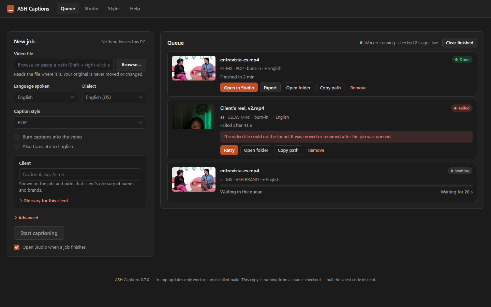
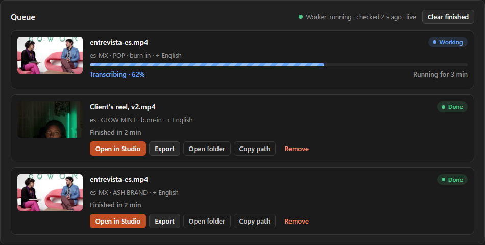
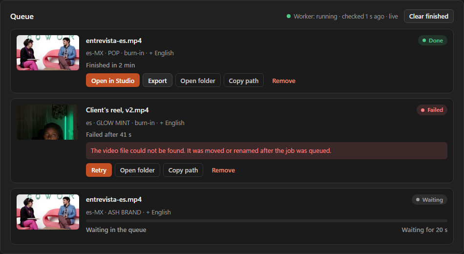
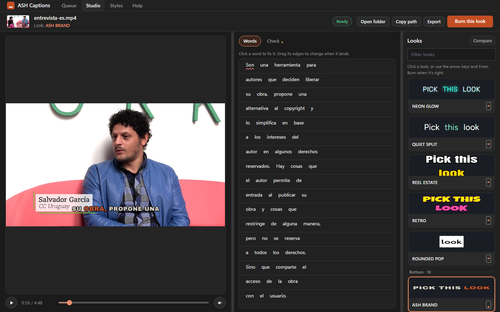
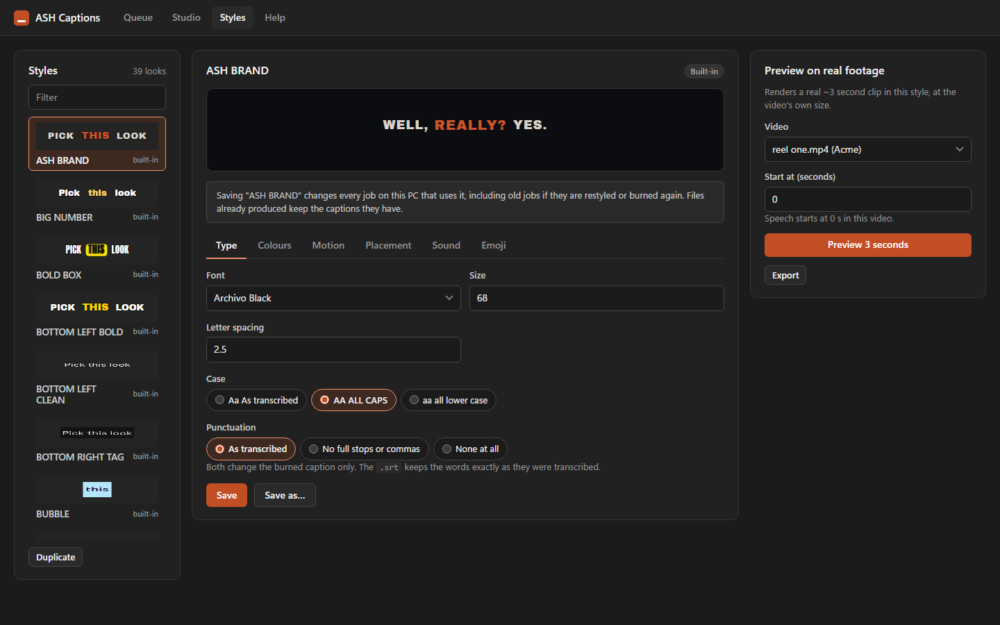

# ASH Captions — Editor's Guide

Everything you need to set the tool up on your PC and use it every day.

Once the app is running, the same guide lives **inside the app** at
`http://127.0.0.1:8756/guide` (the "Help & setup guide" link on the control
page), with a setup checklist, copy buttons on every command, and screenshots
that always match the version you are running. This page exists so you can do
the setup before the app exists.

Every command below was run exactly as written on a real machine on
2026-09-02.

---

## What this tool does

You give it a video. It gives you back:

| File | What it's for |
|---|---|
| `.srt` | Plain captions. Drag straight into Premiere or DaVinci Resolve |
| `.ass` | Styled captions — the animated word-by-word look |
| `.txt` | The transcript as plain text, for descriptions and client review |
| `.en.srt` | English translation, if you asked for one |
| `.captioned.mp4` | The video with captions burned in, ready to post |

It runs entirely on your own PC. Nothing is uploaded anywhere, so client footage
never leaves the building.

---

## Part 1 — Setup (once per PC)

About 15 minutes, most of it downloading.

### Step 1. Install Python

Download **Python 3.12 or newer** from <https://www.python.org/downloads/windows/>
("Windows installer (64-bit)").

**When the installer opens, tick "Add python.exe to PATH" at the bottom before
clicking Install.** This is the one step that causes problems if you miss it.

Check it worked. Press `Win + R`, type `cmd`, press Enter, then run:

```
python --version
```

You should see `Python 3.12` or higher. If you see "not recognised", Python
wasn't added to PATH — re-run the installer, choose Modify, and tick the box.

### Step 2. Get the tool

Install **Git for Windows** from <https://git-scm.com/download/win> with the
default options. Then in a terminal:

```
cd %USERPROFILE%\Desktop
git clone https://github.com/ASHMediaSolutions01/ashcaptions.git "ASH Captions"
```

That creates `C:\Users\<your name>\Desktop\ASH Captions`. No account or login
is needed.

### Step 3. Open a terminal in that folder

Open the folder in File Explorer, click the address bar, type `cmd`, press Enter.
A black window opens already pointing at the right place. Every command below
goes into that window.

### Step 4. Install the tool

Copy and paste these **one at a time**, waiting for each to finish.

**4a. Create the environment** (about 10 seconds):

```
python -m venv .venv
```

**4b. Install what the tool needs** (about 3 minutes — it downloads ~200 MB):

```
.venv\Scripts\python.exe -m pip install -e .
```

The `-e` matters: without it the styles and fonts are not found.

### Step 5. Get ffmpeg, the fonts, and the speech model

**5a. ffmpeg** does the video work (about 2 minutes — ~170 MB):

```
.venv\Scripts\python.exe scripts\fetch_ffmpeg.py
```

**5b. The 24 caption fonts** and their licences (about 1 minute):

```
.venv\Scripts\python.exe -m ash_captions.styles.fonts download
```

You should see `wrote 24 font file(s)`. A yellow `RuntimeWarning` mentioning
"unpredictable behaviour" is a Python quirk about how the command is launched;
**ignore it**.

**5c. The speech model** (about 5 minutes — ~480 MB). Optional: if you skip it,
the first job downloads it by itself.

```
.venv\Scripts\python.exe scripts\fetch_model.py --model-size small --dest models
```

### Step 6. Start the app

```
.venv\Scripts\python.exe -m ash_captions --open
```

Your browser opens at `http://127.0.0.1:8756`. **Leave the black terminal
window open** — closing it stops the app, and a job that was running starts
again from the beginning next time.

That's setup done. Click **"Help & setup guide"** on the page for the rest of
this guide with screenshots.

### Getting updates later

When Ghazi pushes a fix, run these in the same terminal, then start the app
again:

```
git pull
.venv\Scripts\python.exe -m pip install -e .
```

The "Update now" banner inside the app is only for the installed one-click
version; on a source install like this one it never appears.

---

## Part 2 — Captioning a video

Every time: start the app with the Step 6 command, or the desktop shortcut if
one was set up.

### Give it your video



1. In **File Explorer**, find your video. Hold **Shift**, right-click it, and
   choose **"Copy as path"**.
2. Paste that into **Video file location** and press Enter. The quotes Windows
   adds are fine.
3. Pick your options and click **Start captioning**.

**Why paste a path instead of uploading?** Your video is already on this
computer. Pasting the path means the tool reads it where it sits, and your
original is never moved, changed or deleted. The "upload a copy" option is for
small files only (2 GB limit).

### Pick your options

| Setting | What to choose |
|---|---|
| **Language** | The language *spoken* in the video. English, Spanish, Portuguese and 51 others |
| **Dialect** | Affects spelling, e.g. English (US) gives "color", English (UK) gives "colour". For a US client, pick US |
| **Caption style** | The look. `POP` for short-form, `CLEAN` for client-safe, `ASH BRAND` for our own content |
| **Burn captions into the video** | Tick this for a ready-to-post file. Leave it off if you're taking the `.srt` into Premiere |
| **Also translate to English** | Tick for a non-English video where the client wants English subtitles |

### Watch it work



Each job shows what it is doing (**Extracting audio → Transcribing → Writing
captions → Burning captions in**), how far along it is, and a clock that keeps
ticking while it works. The green dot at the top right of the queue means the
worker is alive. You can queue more videos; they run one at a time.



A failed job shows the reason under it, with a **Retry** button.

### Collect your files

```
C:\AshCaptions\out\<your video's name>\
```

If two videos share a name, the second gets its own folder (`name (2)`).
**Your original video is never moved, changed or deleted.**

---

## Part 3 — Hour-long videos

Long files work; they just take a while.

| Length | Transcription (no GPU) | Burn-in at 1080p | Burn-in at 4K |
|---|---|---|---|
| 1-minute reel | ~20 s | ~20 s | ~1 min |
| 10 minutes | ~3–4 min | ~3 min | ~10 min |
| 60 minutes | ~20–25 min | ~20 min | ~60–75 min |
| 90 minutes | ~30–40 min | ~30 min | ~1.5–2 h |

- **Leave the terminal window open and the PC awake.** If the app stops
  mid-job, the job restarts from the beginning next time.
- **You can close the browser tab.** The job keeps running; open the page again
  any time.
- **Watch the clock, not the bar.** "Running for 23 min" ticking means it is
  working. An amber **"Lost contact with the app"** banner means the app itself
  has stopped: check the terminal window.
- **Disk space:** a burned 4K file can be as big as the original. The tool
  refuses to start a burn the drive can't hold and says how much it needs.
- **For 4K deliverables**, consider taking the `.srt` or `.ass` into Premiere
  and exporting there. Transcription is the same speed for 4K; only the burn is
  slower.

---

## Part 4 — Choosing a look

When a job finishes, the **Studio** opens: your video with the captions drawn
live on it, and every look one click away.



1. **Open it.** It opens by itself when a job you started finishes (untick
   "Open Studio when a job finishes" on the control page if you'd rather not),
   or click **Open in Studio** on any finished job.
2. **Click through the looks** on the right. They are grouped by where the
   caption sits: top, centre, bottom, lower third, with left and right
   variants. The captions on the video change in about a second and the
   playhead stays put.
3. **Space** plays and pauses; click a line in the transcript strip to jump.
4. **Burn this look** when it's right. A burn-only job goes into the queue and
   reuses the transcript, so it starts rendering immediately. About two
   minutes for a 5-minute 1080p file.

What you see in the Studio is what gets burned: the browser draws the captions
with the same engine ffmpeg uses. The `.srt` and `.ass` in the output folder
are rewritten each time you pick a look.

### The 36 looks

Every look is a small JSON file in the `styles` folder. The original nine:

| Style | Use it for |
|---|---|
| **CLEAN** | Client work. Deliberately no colour, so it can't clash with a client's brand |
| **POP** | Short-form. The bold box look, one word at a time |
| **ASH BRAND** | Our own content — Ash colours and typeface |
| **HYPE** | Big, centred, two words at a time |
| **KARAOKE** | Colour sweeps through each word |
| **NEON GLOW** | Glowing edge |
| **LOWER THIRD** | Subtle, sits at the bottom |
| **PLAYFUL** | Rounded and friendly |
| **COMIC** | Heavy comic-book impact |


### Making your own

Click **"Design your own caption styles →"** on the control page.



Change anything: font (24 to choose from), size, letter spacing, ALL CAPS, the
four colours, how the active word behaves, how captions enter, and **where they
sit** (top, centre, bottom; left, middle, right).

**Always preview first.** At the bottom, paste a video path and a start time in
seconds where someone is talking, then click **Render preview**. A few seconds
later you get a real clip of your own footage in that style, at the video's
real size.

**Saving:** **Save** updates the style, **Save as…** makes a new one,
**Duplicate** copies it to edit safely, **Reset to shipped** puts a built-in
back.

> If you save a style under a built-in name like `POP`, every future job using
> `POP` on this PC gets *your* version. To make your own look, use **Save as…**
> with a new name. The editor marks a changed built-in as "customized locally".

---

## Part 5 — Captions behind the speaker

For reels: tick **Captions behind the speaker** when you submit, and the
captions are drawn *behind* the person, so their head and hands pass in front
of the words. The tool works out where the person is in every frame on its own
(a small matting model that runs on the CPU), then burns the captions and lays
the person back on top.

- It only applies when **Burn captions into the video** is ticked.
- It costs about the video's own length in extra time: a 60-second reel takes
  about a minute longer. It works on long files too, but an hour-long file
  adds roughly an hour, so use it for short-form.
- It needs a clear single person against the background. Two people, heavy
  motion blur or a very dark shot give a soft edge; check the result.
- The first use downloads the model once (15 MB); the installed version ships
  it.

## Part 6 — Clients and glossaries

Every job can carry a **Client**. Type the client's name in the **Client** box
on the control page (it remembers the last one, and suggests the ones it has
seen). Then:

- The output folder is the same, but the job card and the Studio show the
  client, so you can tell whose job is whose.
- **Names and brands spelled right**: under the Client box, open **Glossary**
  and add one line per word: `wrong spelling => Right Spelling`. Save. From
  then on every job for that client gets those corrections in the `.srt`,
  `.ass`, transcript and English translation. There is also a shared
  glossary that applies to everyone.
- **Watch folder**: a video dropped into `C:\AshCaptions\in\<Client>\` is a
  job for that client, with that client's glossary.

## Part 7 — Punch-in (zooming the footage)

A punch-in is the picture pushing in slightly on a word. It is **off by
default**, because it changes how a client's video is framed. To turn it on,
ask Ghazi to set it in `C:\AshCaptions\settings.json`:

```json
{
  "punch_mode": "sentence",
  "punch_zoom": 1.12,
  "punch_duration_seconds": 1.2,
  "punch_min_spacing_seconds": 5.0
}
```

| Setting | What it does |
|---|---|
| `punch_mode` | `off`, `sentence` (each new sentence), `keyword` (only words you list), or `both` |
| `punch_zoom` | How far in. `1.12` is 12% — noticeable, not seasick-making. Above ~1.2 looks like a mistake |
| `punch_duration_seconds` | How long it holds |
| `punch_min_spacing_seconds` | Never punch more often than this. Without it, fast dialogue zooms constantly |

For keyword mode: `"punch_mode": "keyword", "punch_keywords": ["free", "guarantee", "today"]`.
Punch-in only applies when **Burn captions into the video** is ticked. It works
on hour-long files and costs almost no extra render time.

---

## Part 8 — Problems and fixes

| What you see | What to do |
|---|---|
| `'python' is not recognised` | Python isn't on PATH. Re-run the installer, choose Modify, tick "Add python.exe to PATH" |
| The page won't load, or an amber **"Lost contact"** banner | The terminal window was closed or the app crashed. Start it again with the Step 6 command |
| **"ASH Captions is already running"** | It's already open. Look for the icon near the clock, or another terminal window |
| The queue says **Worker: stopped** | The part that runs jobs has died. Close the terminal, start the app again, send Ghazi the log |
| A job says **FAILED** | Read the reason under it. Usually the file was moved or renamed, or the drive is full. Fix the cause, click **Retry** |
| Captions are in the wrong language | **Language** is the language *spoken* in the video. For translation, tick "Also translate to English" |
| Names or brands spelled wrong | Expected. Open **Glossary** under the Client box, add `wrong => Right`, Save, and run the job again |
| Captions are a plain font, not the style's | The fonts didn't all download. Re-run step 5b |
| "A preview is already rendering" | Only one preview at a time. Wait, then try again |
| "Not enough free space" when burning | Free up the amount it names, or take the `.srt` into Premiere instead |
| Out of memory on a very long file | Close Premiere and spare browser tabs, then Retry. A 90-minute file needs a couple of GB free |

### If you're stuck

Send Ghazi the log file. It says what actually went wrong and is far more
useful than a screenshot of the error:

```
C:\AshCaptions\ash-captions.log
```

---

## Worth knowing

- **Accuracy.** English, Spanish and Portuguese are excellent; most European
  languages very good. **Always skim the result before delivering** — names,
  brands and technical words are where mistakes hide.
- **Apostrophes, commas and accents in file names are fine.** So are network
  drives, as long as they stay connected for the whole job.
- **Nothing is uploaded.** That's why we can sign NDAs without a conversation
  about it.
- **Old outputs clean themselves up** after 30 days. Move anything you want to
  keep into the project folder.
- **Other websites can't touch this app.** Pages open in other tabs are blocked
  from sending it jobs.
