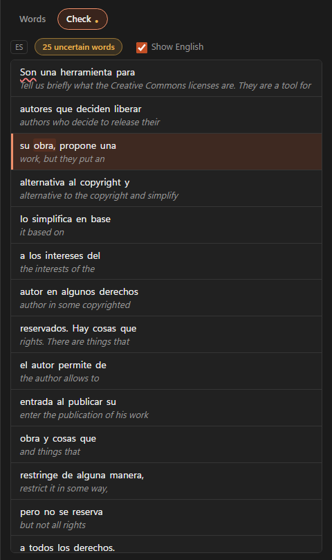
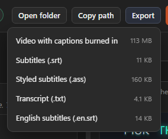

# ASH Captions — Editor's Guide

Everything you need to set the tool up on your PC and use it every day.

Once the app is running, the same guide lives **inside the app** at
`http://127.0.0.1:8756/guide` (the **Help** link in the top bar), with a
setup checklist, copy buttons on every command, and screenshots that always
match the version you are running. `docs/ASH-Captions-Guide.html` is the
same guide as one file, for reading before the app exists.

Every command below was run exactly as written on a real machine on
2026-09-04.

---

## What this tool does

You give it a video. It gives you back:

| File | What it's for |
|---|---|
| `.srt` | Plain captions. Drag straight into Premiere or DaVinci Resolve |
| `.ass` | Styled captions — the animated word-by-word look |
| `.txt` | The transcript as plain text, for descriptions and client review |
| `.en.srt` | English translation, if you asked for one |
| `.captioned.mp4` | The video with captions burned in, ready to post |

It runs entirely on your own PC. Nothing is uploaded anywhere, so client footage
never leaves the building.

---

## Part 1 — Setup (once per PC)

About 15 minutes, most of it downloading.

> Installed with `Install-AshCaptions.bat`? Then this part is already done:
> the app is in your system tray and starts at logon. Skip to Part 2.

### Step 1. Install Python

Download **Python 3.12 or newer** from <https://www.python.org/downloads/windows/>
("Windows installer (64-bit)").

**When the installer opens, tick "Add python.exe to PATH" at the bottom before
clicking Install.** This is the one step that causes problems if you miss it.

Check it worked. Press `Win + R`, type `cmd`, press Enter, then run:

```
python --version
```

You should see `Python 3.12` or higher. If you see "not recognised", Python
wasn't added to PATH — re-run the installer, choose Modify, and tick the box.

### Step 2. Get the tool

Install **Git for Windows** from <https://git-scm.com/download/win> with the
default options. Then in a terminal:

```
cd %USERPROFILE%\Desktop
git clone https://github.com/ASHMediaSolutions01/ashcaptions.git "ASH Captions"
```

That creates `C:\Users\<your name>\Desktop\ASH Captions`. No account or login
is needed.

### Step 3. Open a terminal in that folder

Open the folder in File Explorer, click the address bar, type `cmd`, press Enter.
A black window opens already pointing at the right place. Every command below
goes into that window.

### Step 4. Install the tool

Copy and paste these **one at a time**, waiting for each to finish.

**4a. Create the environment** (about 10 seconds):

```
python -m venv .venv
```

**4b. Install what the tool needs** (about 3 minutes — it downloads ~200 MB):

```
.venv\Scripts\python.exe -m pip install -e .
```

The `-e` matters: without it the styles and fonts are not found.

### Step 5. Get ffmpeg, the fonts, and the speech model

**5a. ffmpeg** does the video work (about 2 minutes — ~170 MB):

```
.venv\Scripts\python.exe scripts\fetch_ffmpeg.py
```

**5b. The 24 caption fonts** and their licences (about 1 minute):

```
.venv\Scripts\python.exe scripts\fetch_fonts.py
```

You should see `wrote 24 font file(s)`.

**5c. The speech model** (about 5 minutes — ~480 MB). Optional: if you skip it,
the first job downloads it by itself.

```
.venv\Scripts\python.exe scripts\fetch_model.py --model-size small --dest models
```

### Step 6. Start the app

```
.venv\Scripts\python.exe -m ash_captions --open
```

Your browser opens at `http://127.0.0.1:8756`. **Leave the black terminal
window open** — closing it stops the app, and a job that was running starts
again from the beginning next time.

That's setup done. Click **"Help & setup guide"** on the page for the rest of
this guide with screenshots.

### Getting updates later

When Ghazi pushes a fix, run these in the same terminal, then start the app
again:

```
git pull
.venv\Scripts\python.exe -m pip install -e .
```

The "Update now" banner inside the app is only for the installed one-click
version; on a source install like this one it never appears.

---

## Part 2 — Starting and stopping

On an installed PC the app starts by itself when you log in and lives in the
system tray, by the clock. You rarely need to start or stop it yourself.

**Is it running?** Look for the round blue **ASH Captions** icon next to the
clock (click the **^** arrow if Windows has tucked it away). If it is there,
the app is running and the watch folder is being watched, even with no
browser window open.

**Opening the control page:**

- Double-click the tray icon, or right-click it and choose **Open control page**.
- Or type `http://127.0.0.1:8756` into any browser on this PC.
- The **ASH Captions** icon on the Desktop and in the Start Menu *starts* the
  app and opens the page. While the app is already running it only says
  "ASH Captions is already running": use the tray icon instead.

**The tray menu:**

| Item | What it does |
|---|---|
| **Open control page** | The queue, in your browser. Same as double-clicking the icon |
| **Open output folder** | Opens `C:\AshCaptions\out` in Explorer |
| **Open log file** | Opens `C:\AshCaptions\ash-captions.log`, the file to send Ghazi when something goes wrong |
| **Quit** | Stops the app. A running job goes back to the front of the queue and picks up next time; the transcript is kept, so only the unfinished stage is redone |

An **Update available** line appears at the top of the menu when there is a
new version. It opens the control page, where the **Update now** button is.

**Starting it again** after Quit: open the Start Menu, type **ASH Captions**,
press Enter. It also comes back by itself at the next logon, through a
scheduled task called `AshCaptionsTray`.

**If the tray icon is missing:**

1. Click the **^** arrow by the clock; Windows hides new tray icons there.
2. Not there either? Start it from the Start Menu as above.
3. If that says **"ASH Captions is already running"** but there is no icon,
   the app is stuck. Press `Ctrl + Shift + Esc` for Task Manager, find
   **AshCaptions.exe** on the Processes tab, click **End task**, then start it
   from the Start Menu again.
4. If nothing starts at logon on this PC, tell Ghazi: the `AshCaptionsTray`
   task was probably created for a different Windows user.

Running from source (Part 1) instead of the installer? The same tray icon
appears, plus a black terminal window. Closing that window also stops the app.

---

## Part 3 — Captioning a video

The app is normally already running in the tray (Part 2). Open the control
page from the tray icon, or type http://127.0.0.1:8756 in your browser.

### Give it your video


1. Click **Browse…** and pick the video (or paste a path into the box; the
   quotes Windows adds with "Copy as path" are fine).
2. Pick your options. They light up as soon as a file is chosen.
3. Click **Start captioning**.

**Why paste a path instead of uploading?** Your video is already on this
computer. Pasting the path means the tool reads it where it sits, and your
original is never moved, changed or deleted. The "upload a copy" option is for
small files only (2 GB limit).

### Pick your options

| Setting | What to choose |
|---|---|
| **Language** | The language *spoken* in the video. English, Spanish, Portuguese and 51 others |
| **Dialect** | Affects spelling, e.g. English (US) gives "color", English (UK) gives "colour". For a US client, pick US |
| **Caption style** | The look. `POP` for short-form, `CLEAN` for client-safe, `ASH BRAND` for our own content |
| **Burn captions into the video** | Tick this for a ready-to-post file. Leave it off if you're taking the `.srt` into Premiere |
| **Also translate to English** | Tick for a non-English video where the client wants English subtitles |

### Watch it work


Each job shows what it is doing (**Extracting audio → Transcribing → Writing
captions → Burning captions in**), how far along it is, and a clock that keeps
ticking while it works. The green dot at the top right of the queue means the
worker is alive. You can queue more videos; they run one at a time.


A finished card shows its badge and how long it took, one **Open in Studio**
button, and the smaller **Open folder** (Explorer, with the burned file
selected), **Copy path** and **Remove** (the row only; your files stay).
**Clear finished** empties the list the same way. When a job you started
finishes you get a toast, a tray balloon, and the Studio opens (untick "Open
Studio when a job finishes" if you'd rather not).

### Collect your files

```
C:\AshCaptions\out\<your video's name>\
```

If two videos share a name, the second gets its own folder (`name (2)`).
**Your original video is never moved, changed or deleted.**

---

## Part 4 — Hour-long videos

Long files work; they just take a while.

| Length | Transcription (no GPU) | Burn-in at 1080p | Burn-in at 4K |
|---|---|---|---|
| 1-minute reel | ~20 s | ~20 s | ~1 min |
| 10 minutes | ~3–4 min | ~3 min | ~10 min |
| 60 minutes | ~20–25 min | ~20 min | ~60–75 min |
| 90 minutes | ~30–40 min | ~30 min | ~1.5–2 h |

- **Leave the terminal window open and the PC awake.** If the app stops
  mid-job, the job picks up again next time (the transcript is kept, so only
  the unfinished stage is redone).
- **You can close the browser tab.** The job keeps running; open the page again
  any time.
- **Watch the clock, not the bar.** "Running for 23 min" ticking means it is
  working. An amber **"Lost contact with the app"** banner means the app itself
  has stopped: check the terminal window.
- **Disk space:** a burned 4K file can be as big as the original. The tool
  refuses to start a burn the drive can't hold and says how much it needs.
- **For 4K deliverables**, consider taking the `.srt` or `.ass` into Premiere
  and exporting there. Transcription is the same speed for 4K; only the burn is
  slower.

---

## Part 5 — Choosing a look

When a job finishes, the **Studio** opens: your video with the captions drawn
live on it, and every look one click away.


1. **Open it.** It opens by itself when a job you started finishes (untick
   "Open Studio when a job finishes" on the control page if you'd rather not),
   or click **Open in Studio** on any finished job.
2. **Click through the looks** on the right. They are grouped by where the
   caption sits: top, centre, bottom, lower third, with left and right
   variants. The captions on the video change in about a second and the
   playhead stays put.
3. **Space** plays and pauses; click a line in the transcript strip to jump.
4. **Burn this look** when it's right. A burn-only job goes into the queue and
   reuses the transcript, so it starts rendering immediately. About two
   minutes for a 5-minute 1080p file.

What you see in the Studio is what gets burned: the browser draws the captions
with the same engine ffmpeg uses. The `.ass` in the output folder is rewritten
each time you pick a look; the `.srt` (plain text, no styling) is unchanged.

### The 36 looks

Every look is a small JSON file in the `styles` folder. The original nine:

| Style | Use it for |
|---|---|
| **CLEAN** | Client work. Deliberately no colour, so it can't clash with a client's brand |
| **POP** | Short-form. The bold box look, one word at a time |
| **ASH BRAND** | Our own content — Ash colours and typeface |
| **HYPE** | Big, centred, two words at a time |
| **KARAOKE** | Colour sweeps through each word |
| **NEON GLOW** | Glowing edge |
| **LOWER THIRD** | Subtle, sits at the bottom |
| **PLAYFUL** | Rounded and friendly |
| **COMIC** | Heavy comic-book impact |


### Making your own

Click **"Design your own caption styles →"** on the control page.


Change anything: font (24 to choose from), size, letter spacing, ALL CAPS, the
four colours, how the active word behaves, how captions enter, and **where they
sit** (top, centre, bottom; left, middle, right).

**Always preview first.** At the bottom, paste a video path and a start time in
seconds where someone is talking, then click **Render preview**. A few seconds
later you get a real clip of your own footage in that style, at the video's
real size.

**Saving:** **Save** updates the style, **Save as…** makes a new one,
**Duplicate** copies it to edit safely, **Reset to shipped** puts a built-in
back.

> If you save a style under a built-in name like `POP`, every future job using
> `POP` on this PC gets *your* version. To make your own look, use **Save as…**
> with a new name. The editor marks a changed built-in as "customized locally".

## Part 6 — Moving a caption

Every look puts the caption at a fixed spot: bottom, centre, top or lower
third. When that spot covers a face, a logo or a lower-third graphic, drag
the caption somewhere else. The position belongs to the job, so it survives
changing the look and is what gets burned.


1. In the Studio, point at the caption on the video. A dashed outline
   appears around it.
2. Drag the outline where you want the caption and let go. The captions
   redraw there in about a second; the playhead stays where it was.
3. For small adjustments, click the caption once, then nudge it with the
   arrow keys: 1% of the frame per press, 5% with `Shift` held.
4. **Reset position** in the top bar (or `Esc` with the caption selected)
   puts it back where the look wants it.

Picking another look keeps your position. **Burn this look** uses the
position you see, and so does the `.ass` in the output folder.

## Part 7 — Checking captions in a language you don't speak

A Spanish interview for a client, and nobody on the desk speaks Spanish. The
transcript panel under the video tells you *where to look*.



- **Uncertain words** are underlined: amber when the model was unsure, red
  when it was guessing. The chip above the panel says how many there are;
  click it to jump to the next one, and the video seeks there so you can
  listen.
- **Show English.** When the job was translated ("Also translate to English"
  was ticked), switch it on to see the English line under each source line.
- **Translate to check.** When the job was not translated, this button takes
  the toggle's place. It runs only the translation, from the transcript the
  job already has, so it takes seconds, and it writes the `.en.srt` into the
  output folder.

When a word is wrong, fix it here: see Part 8. For anything you are unsure
about, ask a speaker of the language to check the moments the chip points at.
Underlines mark doubt, not errors: most amber words are right, red ones are
worth a listen.

---

## Part 8 — Fixing a word

The speech model gets a name wrong, or hears "haramienta" for "herramienta".
Click the word in the transcript and type the right one. Nothing is
transcribed again: the captions redraw in about a quarter of a second, and
the `.srt`, `.ass` and `.txt` in the output folder are rewritten with it.

1. In the Studio, click the word in the transcript panel under the video.
2. Type the correction, then choose:
   - **Fix this one** changes this occurrence.
   - **Fix every "haramienta"** changes all of them in this video, and says
     how many that is.
3. **Always spell it this way** also adds it to the client's glossary
   (Part 13), so the next job for that client gets it right while it is
   still transcribing.

- **Splitting and joining lines.** Put the cursor where the line should break
  and press Enter, or use **Join with the line above**. Use it when a caption
  breaks mid-phrase.
- **Timing.** Drag the left or right edge of a word's row to move its start
  or end. It cannot pass its neighbours.
- A word you have fixed loses its uncertainty underline: a word you typed has
  no model confidence to report.

Two Studio tabs open on the same video? The second is told the transcript
changed and offered a reload, rather than quietly overwriting your work.

---

## Part 9 — Making one word stand out

One word in a sentence deserves to be bigger, or amber, or bold. Click it and
set it, without touching the look and without affecting any other video.

1. Click a word, on the video or in the transcript. A small toolbar appears.
2. Set its colour, its size as a percentage of the look's own size, bold or
   italic. The controls start at whatever the look already gives that word,
   so you are adjusting rather than starting from nothing.
3. The line above the controls says what you are changing: **this word only**.
   To change every caption in every video instead, that is the look, and the
   link takes you there.

- A word you have changed carries a small dot in the transcript, so you can
  see later what you touched.
- **Reset word** puts one back; **Reset all overrides on this job** puts them
  all back.
- Font and outline stay properties of the look, on purpose: mixing five
  typefaces into one caption makes a mess faster than it makes a point.

---

## Part 10 — The reel look

Three looks — **REEL ESTATE**, **QUIET SPLIT** and **BIG NUMBER** — do not
put the caption on one line. They place each word at its own spot, at its own
size and colour, and leave it there while the next word arrives. It is the
treatment on the property and coaching reels that get shared around.

1. Pick one in the Studio like any other look.
2. The look decides where each word goes, from how long it is and what job it
   does in the sentence: a number or a long word gets the big treatment,
   "the" and "and" get the small italic one.
3. Anything it puts in a bad place, drag. A word you move stays where you put
   it.

- These looks are built for a vertical reel. They work on a landscape video
  and keep their proportions, but they are designed for 9:16.
- They keep clear of the top and bottom of the frame, where TikTok and Reels
  draw their own buttons over your video.
- A very long word on the biggest slot can run past the edge of the frame.
  Drag it, or pick a calmer look.

---

## Part 11 — Getting your files out

**Export** hands you the file. It is in the Studio's top bar, on every
finished row in the queue, and on the Styles page.


- **Video with captions burned in** — the finished MP4. If the job has not
  been burned yet, this queues the burn and shows you how it is going; you
  can leave the page and it keeps working.
- **Subtitles (.srt)** — drags straight into Premiere or Resolve.
- **Styled subtitles (.ass)** — the animated look, for burning elsewhere.
- **Transcript (.txt)** — for descriptions and client review.
- **English subtitles (.en.srt)** — when the job was translated.

**Open folder** and **Copy path** are still there, and are still the quickest
route when the next thing you do is drag the `.ass` into Premiere.

The **Preview 3 seconds** button on the Styles page is not an export. It
renders three seconds so you can see a look on real footage. The whole video
comes from Export.

---

## Part 12 — Captions behind the speaker

For reels: tick **Captions behind the speaker** when you submit, and the
captions are drawn *behind* the person, so their head and hands pass in front
of the words. The tool works out where the person is in every frame on its own
(a small matting model that runs on the CPU), then burns the captions and lays
the person back on top.

- It only applies when **Burn captions into the video** is ticked.
- It costs about the video's own length in extra time: a 60-second reel takes
  about a minute longer. It works on long files too, but an hour-long file
  adds roughly an hour, so use it for short-form.
- It needs a clear single person against the background. Two people, heavy
  motion blur or a very dark shot give a soft edge; check the result.
- The first use downloads the model once (15 MB); the installed version ships
  it.

## Part 13 — Clients and glossaries

Every job can carry a **Client**. Type the client's name in the **Client** box
on the control page (it remembers the last one, and suggests the ones it has
seen). Then:

- The output folder is the same, but the job card and the Studio show the
  client, so you can tell whose job is whose.
- **Names and brands spelled right**: under the Client box, open **Glossary**
  and add one line per word: `wrong spelling => Right Spelling`. Save. From
  then on every job for that client gets those corrections in the `.srt`,
  `.ass`, transcript and English translation. There is also a shared
  glossary that applies to everyone.
- **Watch folder**: a video dropped into `C:\AshCaptions\in\<Client>\` is a
  job for that client, with that client's glossary.

## Part 14 — Punch-in (zooming the footage)

A punch-in is the picture pushing in slightly on a word. It is **off by
default**, because it changes how a client's video is framed. To turn it on,
ask Ghazi to set it in `C:\AshCaptions\settings.json`:

```json
{
  "punch_mode": "sentence",
  "punch_zoom": 1.12,
  "punch_duration_seconds": 1.2,
  "punch_min_spacing_seconds": 5.0
}
```

| Setting | What it does |
|---|---|
| `punch_mode` | `off`, `sentence` (each new sentence), `keyword` (only words you list), or `both` |
| `punch_zoom` | How far in. `1.12` is 12% — noticeable, not seasick-making. Above ~1.2 looks like a mistake |
| `punch_duration_seconds` | How long it holds |
| `punch_min_spacing_seconds` | Never punch more often than this. Without it, fast dialogue zooms constantly |

For keyword mode: `"punch_mode": "keyword", "punch_keywords": ["free", "guarantee", "today"]`.
Punch-in only applies when **Burn captions into the video** is ticked. It works
on hour-long files and costs almost no extra render time.

---

## Part 15 — Sound effects

A look can fire a short sound on the word the caption lands on — a pop, a
whoosh, a low impact. It is the same idea as the punch-in: the captions say
what is being said, and the sound says it matters. Five sounds ship with the
app; nothing is downloaded and nothing needs a licence.

Unlike the punch-in, this belongs to the **look**, not to a settings file.
Open **Styles**, pick a look, and go to the **Sound** tab.

1. **Play them first.** Every sound has a **Play** button. The volume you set
   is the volume you hear, so set it before you judge.
2. **Choose when it fires.** *Each sentence* is the safe one on a talking
   head. *Keywords* uses the same word list the punch-in uses. *Every word*
   only works with a very short sound — use Click — and a look that shows
   one word at a time.
3. **Pick up to four sounds.** They play in the order you picked them and
   then start again, so two sounds alternate. The number on the left is the
   play order.
4. **Nudge** is a fine offset in milliseconds. Negative starts the sound
   slightly *before* the word, which usually sounds better: the ear places a
   sound by its attack.

| Sound | When to use it |
| --- | --- |
| Pop | The default. Reads on a phone speaker without covering the voice. |
| Click | Barely there. The only one that survives firing on every word. |
| Whoosh | The transition sound. Best where captions arrive a line at a time. |
| Impact | A low thump. Keep it for keywords; on every sentence it becomes exhausting. |
| Riser | Points at the word after it. The last line before a punchline, not everywhere. |

**Sound belongs to the look, so it follows the look everywhere.** Adding a
sound to a built-in look changes every job on this PC that uses it, including
old jobs if they are restyled or burned again — the same warning the Styles
page shows. If only one client wants sound, **Save as…** a copy and put the
sound on that.

Sound is only mixed in when **Burn captions into the video** is ticked — an
`.srt` cannot carry a whoosh. The video keeps its original length and its
dialogue; the sounds are added underneath, nothing is replaced or ducked.

## Part 16 — Problems and fixes

| What you see | What to do |
|---|---|
| `'python' is not recognised` | Python isn't on PATH. Re-run the installer, choose Modify, tick "Add python.exe to PATH" |
| The page won't load, or an amber **"Lost contact"** banner | The terminal window was closed or the app crashed. Start it again with the Step 6 command |
| **"ASH Captions is already running"** | It's already open. Look for the icon near the clock, or another terminal window |
| The queue says **Worker: stopped** | The part that runs jobs has died. Close the terminal, start the app again, send Ghazi the log |
| A job says **FAILED** | Read the reason under it. Usually the file was moved or renamed, or the drive is full. Fix the cause, click **Retry** |
| Captions are in the wrong language | **Language** is the language *spoken* in the video. For translation, tick "Also translate to English" |
| Names or brands spelled wrong | Expected. Open **Glossary** under the Client box, add `wrong => Right`, Save, and run the job again |
| Captions are a plain font, not the style's | The fonts didn't all download. Re-run step 5b |
| "A preview is already rendering" | Only one preview at a time. Wait, then try again |
| "Not enough free space" when burning | Free up the amount it names, or take the `.srt` into Premiere instead |
| Out of memory on a very long file | Close Premiere and spare browser tabs, then Retry. A 90-minute file needs a couple of GB free |

### If you're stuck

Send Ghazi the log file. It says what actually went wrong and is far more
useful than a screenshot of the error:

```
C:\AshCaptions\ash-captions.log
```

---

## Part 17 — Uninstalling

Double-click `Uninstall-AshCaptions.bat`. It sits beside
`Install-AshCaptions.bat`, wherever Ghazi gave you that; if you no longer
have it, ask for it again. Windows may show the same blue "protected your
PC" box as at install time: **More info**, then **Run anyway**.

It quits the app, removes the logon task and the Desktop and Start Menu
icons, and deletes the program folder. **Your captions stay:**
`C:\AshCaptions` (the `in`, `out` and `glossaries` folders, the settings and
the log) is kept, and the script says so when it finishes. Delete that
folder yourself if you want it gone. Reinstalling later picks it straight
back up.

---

## Part 18 — Worth knowing

- **Accuracy.** English, Spanish and Portuguese are excellent; most European
  languages very good. **Arabic**: the `.srt` and transcript are fine; for a
  styled look use CLEAN or POP, not the karaoke looks (the sweep runs the wrong
  way for right-to-left text). **Always skim the result before delivering** — names,
  brands and technical words are where mistakes hide.
- **Apostrophes, commas and accents in file names are fine.** So are network
  drives, as long as they stay connected for the whole job.
- **Nothing is uploaded.** That's why we can sign NDAs without a conversation
  about it.
- **Old outputs clean themselves up** after 30 days. Move anything you want to
  keep into the project folder.
- **Other websites can't touch this app.** Pages open in other tabs are blocked
  from sending it jobs.
